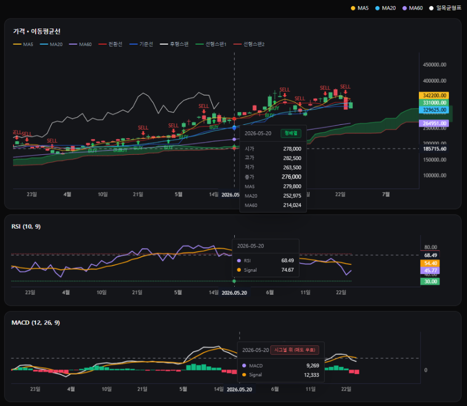
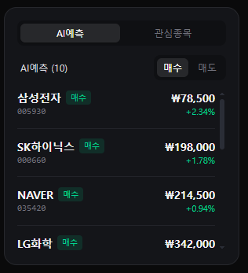
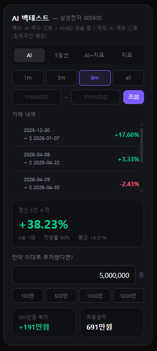
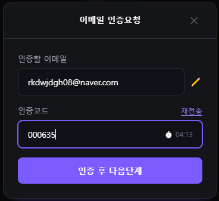
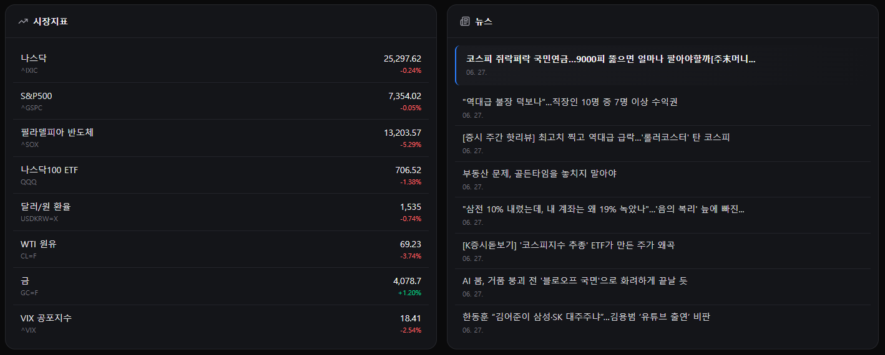

# RichClub — AI 주식 매매 신호 플랫폼

> AI가 분석한 매수·매도 신호를 차트에서 바로 확인하고, 백테스트로 전략의 실제 수익률을 검증할 수 있는 주식 분석 서비스

[RichClub 바로가기](https://richclub.mayo.im/)

<br>

## 화면 구성

### 차트 — 캔들 + AI 신호 + 보조지표



캔들차트 위에 AI 매수(▲) / 매도(▼) 신호를 마커로 표시하며, MA5 / MA20 / MA60 이동평균선과 일목균형표를 토글로 on/off할 수 있습니다. 하단에는 RSI, MACD 보조지표 차트를 별도로 제공하고, 마우스 hover 시 시가·고가·저가·종가·각 지표 수치를 툴팁으로 보여줍니다.

<br>

### AI 예측 종목 리스트



AI가 선별한 매수 / 매도 종목을 제공합니다. 종목명 / 코드 / 현재가 / 등락률을 표시하며, 관심종목 탭에서 즐겨찾기 관리가 가능합니다.

<br>

### AI 매매 시뮬레이터



4가지 전략(AI / 5일선 / AI+지표 / 지표)을 선택해 과거 데이터 기반 수익률을 검증할 수 있습니다. 기간은 1m / 3m / 6m / 전체 또는 날짜 직접 입력으로 설정하며, 거래 내역(날짜·수익률)과 누적 요약(승률·적중률·평균 수익률)을 함께 제공합니다. 하단 투자 시뮬레이터에서 원하는 금액을 입력하면 해당 전략으로 실제 투자했을 때의 최종 금액을 계산해줍니다.

<br>

### 로그인 / 회원가입



이메일 인증 기반 3단계 회원가입(이메일 입력 → 인증코드 확인 → 닉네임·비밀번호 설정)을 제공합니다. 인증코드는 5분 타이머와 재전송 기능을 지원하며, 비밀번호 찾기도 동일한 3단계 플로우로 동작합니다. 인증 정보는 쿠키 기반 accessToken으로 관리합니다.

<br>

### 시장지표 / 뉴스



주요 시장지표와 최신 금융 뉴스를 한 화면에서 확인할 수 있습니다.

<br>

---

## 기술 스택

| 분류      | 기술               |
| --------- | ------------------ |
| Framework | React + TypeScript |
| Styling   | Tailwind CSS       |
| 상태관리  | Zustand            |
| 폼 관리   | React Hook Form    |
| HTTP      | Axios              |
| 알림      | SweetAlert2        |
| 라우팅    | React Router       |
| 차트      | lightweight-charts |

<br>

---

## 시작하기

```bash
npm install
npm run dev
```

### 환경변수 설정

루트에 `.env` 파일을 생성하고 아래 값을 입력하세요.

```dotenv
VITE_NAVER_CLIENT_ID=your_naver_client_id
VITE_NAVER_CLIENT_SECRET=your_naver_client_secret
```

네이버 API 키는 [네이버 개발자 센터](https://developers.naver.com)에서 발급받을 수 있습니다.

<br>

---

## 핵심 구현 포인트

**일목균형표 직접 계산**
전환선·기준선·후행스팬·선행스팬1·선행스팬2를 라이브러리 없이 직접 계산해 lightweight-charts의 커스텀 시리즈로 렌더링했습니다.

**AI 시뮬레이터 4가지 전략 로직**
단순 AI 신호 외에 MA 정배열/역배열, MA60 방향성, 5일선 꺾임 등 기술적 지표를 조합한 4가지 진입·청산 전략을 구현했습니다.

**MA 정배열 / 역배열 실시간 감지**
MA5 > MA20 > MA60 조건을 매 캔들마다 판단해 정배열/역배열 구간을 차트에 시각적으로 표시합니다.

**Skeleton UI**
AI 시뮬레이터 조회 중 레이아웃 시프트 없이 동일한 구조의 skeleton을 보여줘 로딩 경험을 개선했습니다.

<br>

---

## 프로젝트 구조

```
src/
├── api/
├── assets/
│   ├── images/
│   └── screenshots/
├── components/
│   ├── auth/
│   │   ├── ForgotPassword.tsx
│   │   ├── Login.tsx
│   │   └── SignUp.tsx
│   ├── chart/
│   │   ├── ChartControls.tsx
│   │   ├── MACDChart.tsx
│   │   ├── PriceChart.tsx
│   │   ├── PriceChartLegend.tsx
│   │   └── RSIChart.tsx
│   ├── layout/
│   │   └── Header.tsx
│   ├── market-indicator/
│   │   └── MarketIndicatorList.tsx
│   ├── news/
│   │   └── NewsList.tsx
│   ├── stock/
│   │   ├── AIStockList.tsx
│   │   ├── StockCard.tsx
│   │   └── WinrateTest.tsx
│   ├── subscription/
│   │   └── Subscription.tsx
│   ├── trade-history/
│   │   ├── TradeHistoryEditForm.tsx
│   │   ├── TradeHistoryForm.tsx
│   │   ├── TradeHistoryHeader.tsx
│   │   ├── TradeHistoryList.tsx
│   │   ├── TradeHistoryPanel.tsx
│   │   └── TradeHistoryTrash.tsx
│   └── ui/
│       ├── BlurText.tsx
│       ├── ChartTooltip.tsx
│       ├── InputField.tsx
│       ├── MAToggle.tsx
│       ├── Modal.tsx
│       └── SearchBar.tsx
├── constants/
│   └── tradeStyles.ts
├── lib/
│   ├── styles.ts
│   └── swal.ts
├── pages/
│   ├── auth/
│   │   └── LoginPage.tsx
│   └── MainPage.tsx
├── stores/
│   ├── useAuthStore.ts
│   ├── useChartStore.ts
│   ├── useModalStore.ts
│   ├── useStockStore.ts
│   ├── useTooltipStore.ts
│   └── useWatchlistStore.ts
├── types/
│   ├── stock.ts
│   └── trade-history.ts
├── utils/
│   ├── chartUtils.ts
│   └── cookie.ts
├── App.tsx
├── index.css
└── main.tsx
```
